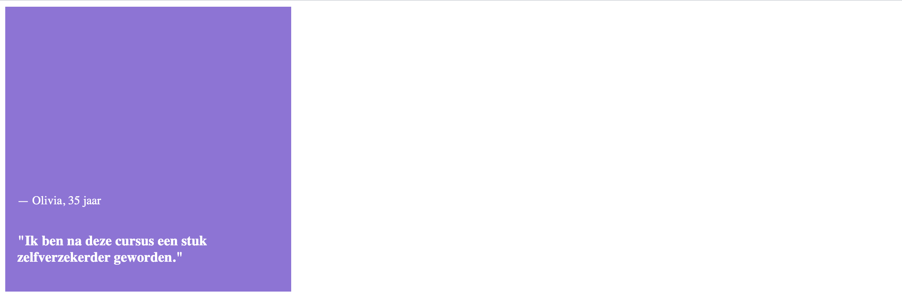
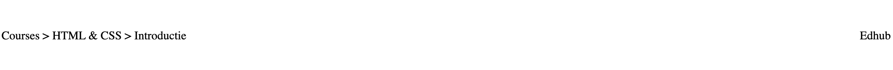
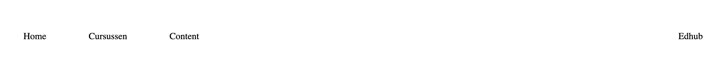
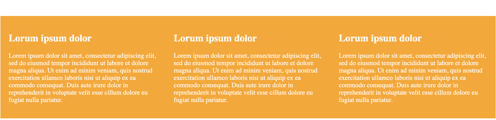
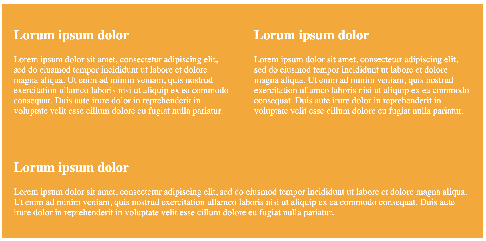
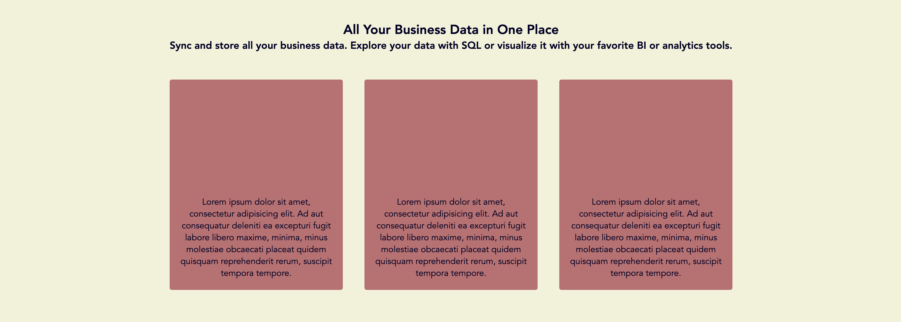
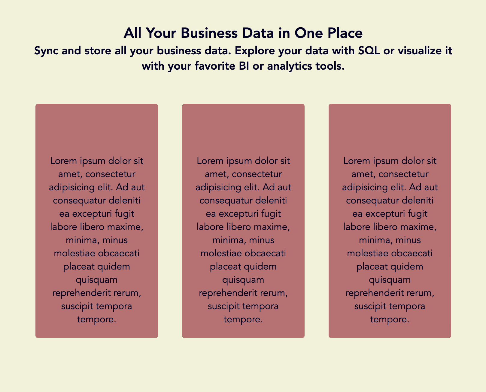
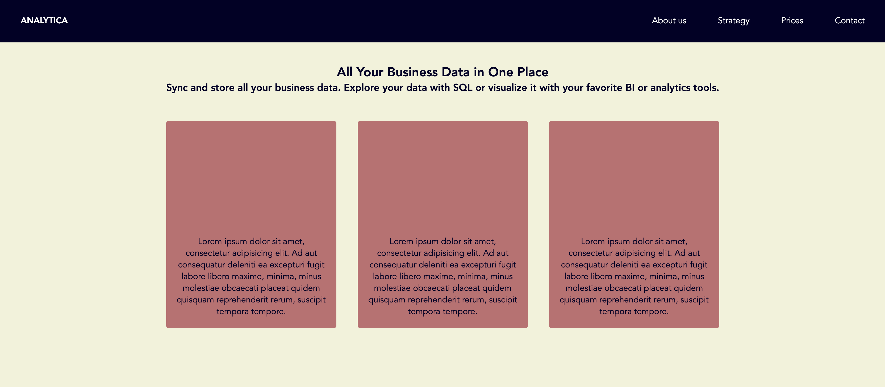
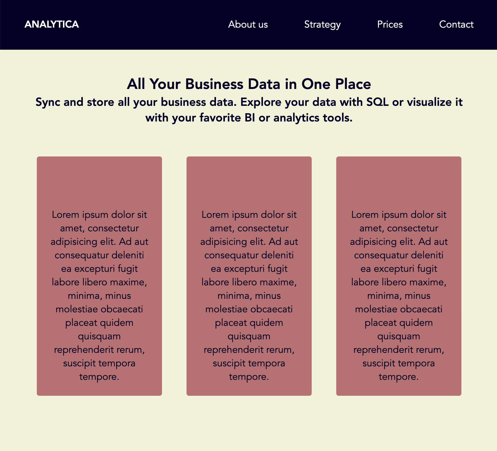

# Opdrachtbeschrijving

## Opdracht 1 - Kleine flexbox oefeningen

De styling voor de elementen in `index.html` (map `/opdracht-2`) is nog niet helemaal af. Er is namelijk nog helemaal geen flexbox toegepast! Bekijk de HTML eens goed en gebruik het CSS bestand `styles.css` (in dezelfde map) om de elementen er net zo uit te laten zien als het eindresultaat hieronder.

### Aandachtspunten

In `index.html` vindt je de HTML voor de opdracht. Denk eraan:
* Denk eraan dat je niets in het HTML-bestand mag veranderen, behalve het toevoegen van een `class` of `id`-attribuut waar nodig.
* Alle `div`-tags in het HTML-bestand hebben een class-naam die overeenkomt met het opdrachtnummer. Deze mag je niet aanpassen.
* Je kunt voor het gemak de andere HTML-elementen uit-commentariëren als je met een specifieke opdracht bezig bent.
* Je hoeft zelf geen nieuwe bestanden aan te maken. Het `styles.css` bestand in de map `opdracht-1` is al gekoppeld aan het HTML bestand
* Aan het CSS bestand in de map `/base` mag je niets veranderen!
* Houd er rekening mee dat de body `1200px` breed is.
* Houd het cheatsheet van CSS Tricks bij de hand voor alle [Flexbox properties](https://css-tricks.com/snippets/css/a-guide-to-flexbox/).

### Eindresultaat opdracht 1.1:
Zorg dat het paarse review-blok er zo uit komt te zien door flexbox te gebruiken:

### Eindresultaat opdracht 1.2:
Zorg dat de `
` er zo uit komt te zien door flexbox te gebruiken:

### Eindresultaat opdracht 1.3:
Zorg dat de `
` er zo uit komt te zien door flexbox te gebruiken:

### Eindresultaat opdracht 1.4:
Zorg dat het login-blok er zo uit komt te zien door flexbox te gebruiken:

### Eindresultaat opdracht 1.5:
Zorg dat de layout van de gele blokken er zo uit komt te zien door flexbox te gebruiken.
Elk blok heeft een minimale breedte van 1/3 van het originele scherm van 1200px. **Let op:** er zit ook nog padding op.

Als het scherm kleiner wordt, willen we dat de blokken op de volgende regel wrappen zodra ze niet meer passen:

## Opdracht 2 - Landingspagina
Je gaat de landingspagina van een bedrijfswebsite bouwen. Deze zal er uiteindelijk zo uit komen te zien:

### Eindresultaat
#### Breed scherm

#### Smaller scherm

Dit keer maak je de HTML echter zelf. Denk dus goed na over elementen die je wellicht moet gebruiken als groepperende container.

### Randvoorwaarden
* De kleuren die gebruikt zijn komen uit [dit palet](https://coolors.co/151e3f-030027-f2f3d9-dc9e82-c16e70). Het lettertype mag je zelf uitkiezen.
* De titels hebben we er alvast ingezet, maar de andere elementen mag je zelf maken. Je gaat nu dus zowel aan de slag in het CSS-bestand, als in het HTML-bestand.
* Zorg dat in ieder rood blok een element is, met daarin een `
`-element van 30 woorden. Deze tekst moet altijd aan de onderkant van het blok staan. Deze rode blokken mogen maximaal 280 pixels breed worden en evenredig krimpen als er minder ruimte beschikbaar is. Ze moeten altijd `350px` hoog zijn.
* Zorg dat alle tekst op de pagina in het midden is uitgelijnt.
* Let op: je hoeft geen gebruik te maken van media-queries.

## Opdracht 3 - Navigatie
De landingspagina is zo goed als af! Je gaat deze pagina nu uitbreiden met een navigatiebalk. Dit doe je uiteraard in hetzelfde bestand. Deze navigatiebalk staat boven de rest van de content en ziet er zo uit:

### Eindresultaat
#### Breed scherm

#### Smaller scherm

### Randvoorwaarden
* De content staat altijd 40 pixels van de rand van het scherm af, zowel in de navigatiebalk als op de pagina zelf.
* Let op: je hoeft geen gebruik te maken van media-queries.

